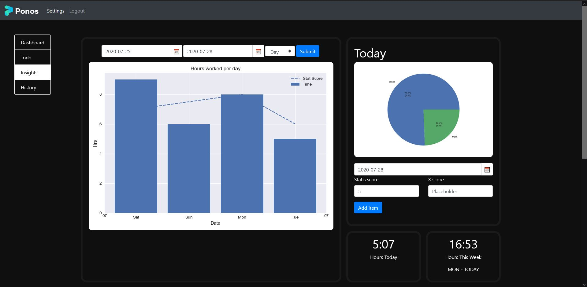

# Ponos
Ponos is a web based, locally hosted time and productivity tracker, enabling people to analyze and optimize their behavior, productivity, and happiness with the help of detailed graphs.
This project is comparable to the time tracker toggle.com, but with 2 major differences:
-	Ponos can easily be hosted on your own network, giving you control over your own data
-	There exists a build in to-do list
-	Plot custom variables across time
-	The project can also easily be customized

## Login & registration
Simply click register and register your account, after that you can login into your dashboard
## Dashboard

##### Add group
Here you can add some categories, these will be displayed in your graphs later
##### Add Item
Using the dropdown, select a group and add an item to it
Deleting items and groups is fairly straightforward
##### Start timer
Start timer and log your time for the item for
the current day
*The time displayed may not be accurate sometimes depending upon your browser, to fix this simply refresh the page*
*When starting a timer make sure there ins’t one running already (this may be fixed later)*

##### Today’s timetable
At the bottom of the dashboard you’ll see all your time entries grouped by their group (if you have made time entries)
You can click on a group to show and edit individual time entries, there are 3 options for editing a time entries time:
1.	Enter in a negative number, this subtracts the entered number of minutes from the time entry, if the resulting time entry is lower than 0, it will be deleted.
2.	Enter in any positive integer, the entered amount will be added to the time entry
3.	Leave the input box at 0, this will delete the time entry

## Todo

Simply add to-do’s to any day by entering a name, optional description and optional date.
Once a to-do has been added you can complete it, uncomplete it or delete it.
## Insights

##### Hours worked graph
This graph allows you to see the logged hours per day, the two date selectors allow you to select a certain date range, from [1st date selector] to [2nd date selector].
The ‘day’ dropdown allows you to set a detail level: daily, weekly, monthly, and yearly.
##### Today
The today section shows an pie chart, with an distribution of all the groups of the logged hours from today.
The statis score and the x score let you plot your own variables per day, you can select the day to add the scores to, with the date selector above.
##### Slice from time selection

This pie chart shows the breakdown of the groups from the date selection from the hours worked graph.
The table to left shows the same data but in table form.
## History

This page shows all the total time per item per day.
